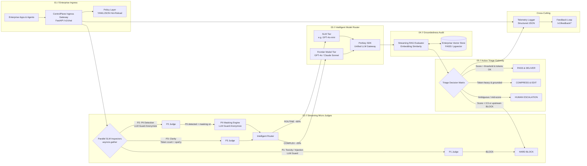
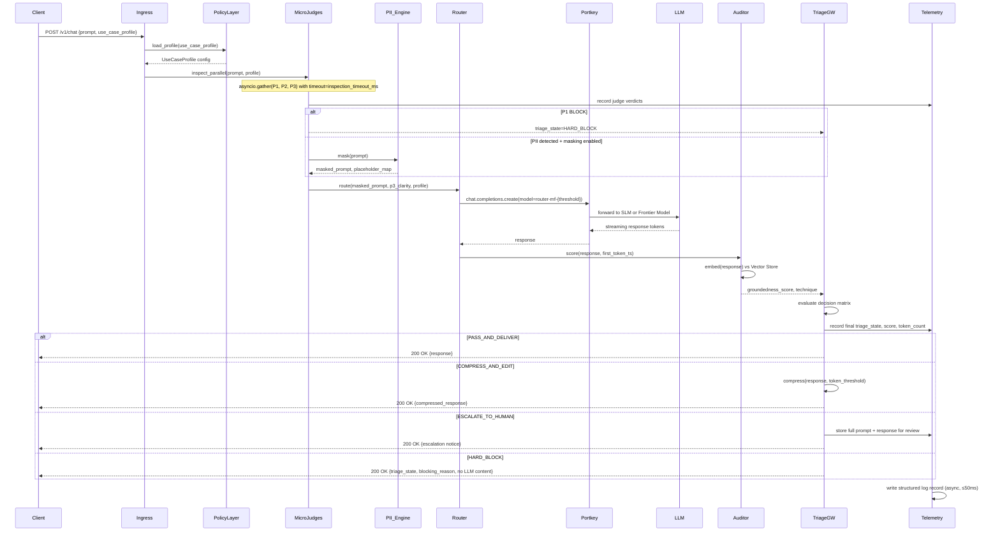

# Design Document: ControlPlane.ai Enterprise AI Proxy Gateway

## Overview

ControlPlane.ai is a Python-based enterprise AI proxy gateway that mediates every interaction between enterprise applications or agents and the underlying large language models. Rather than letting callers speak directly to an LLM, every request travels through a deterministic five-stage pipeline that enforces safety, cost governance, groundedness assurance, and output triage before a response is delivered.

The system is built as a FastAPI application and integrates three specialist libraries:

- **LLM Guard** (Protect AI) — provides the input and output scanning infrastructure for toxicity, prompt-injection, and PII detection used by the Micro-Judge stage.
- **RouteLLM** (lm-sys) — provides the complexity-based router that decides whether a prompt goes to a cheap Small Language Model or an expensive Frontier Model.
- **Portkey** — acts as the unified LLM API gateway layer, providing normalised access to both model tiers, automatic retries, observability hooks, and fallback logic.

The five pipeline stages are:

1. **Enterprise Ingress** — HTTP endpoint, request validation, policy profile loading.
2. **Streaming Micro-Judges** — three parallel LLM Guard inspectors (P1, P2, P3).
3. **Intelligent Model Router** — RouteLLM complexity classification and model-tier dispatch via Portkey.
4. **Groundedness Audit** — streaming RAG evaluator against the Enterprise Vector Store.
5. **Action Triage Gateway** — deterministic four-state decision matrix producing the final disposition.

A cross-cutting **Telemetry Logger** records one structured record per request, and a **Policy Layer** drives all configurable thresholds via hot-reloaded YAML or JSON files.

---

## Architecture

### High-Level Component Diagram



### Request Lifecycle (Data Flow)



---

## Components and Interfaces

### 1. Enterprise Ingress (`app/ingress/router.py`)

The ingress layer is a single FastAPI router mounted at `/v1/chat`. It is responsible for:

- Parsing and validating the incoming `ChatRequest` body.
- Assigning a UUID v4 `request_id`.
- Loading the `UseCaseProfile` from the Policy Layer.
- Enforcing the per-profile `latency_budget_ms` as an `asyncio.wait_for` timeout over the entire downstream pipeline.
- Returning structured HTTP error responses for validation failures (422) and timeouts (504).

**Key design decision — timeout enforcement**: The latency budget is enforced by wrapping the full pipeline coroutine in `asyncio.wait_for(pipeline_coro, timeout=profile.latency_budget_ms / 1000)`. This ensures the budget covers all five stages end-to-end without requiring each stage to be individually aware of the budget.

**Concurrency isolation**: Each request creates its own `RequestContext` dataclass (see Data Models) that is passed by value through the pipeline. No mutable shared state is attached to the application instance. This prevents context bleed between concurrent requests.

```python
# Interface
async def handle_chat(
    request: ChatRequest,
    profile: UseCaseProfile,   # injected by FastAPI dependency
    request_id: str,           # UUID v4, injected by dependency
) -> ChatResponse | ErrorResponse
```

---

### 2. Policy Layer (`app/policy/loader.py`)

The Policy Layer loads Use Case Profile configurations from a YAML or JSON file on disk. It uses a `watchdog` file-system observer to detect file modifications and reloads the configuration within 5 seconds. The loaded profiles are stored in a thread-safe `dict` protected by an `asyncio.Lock`.

**Hot-reload strategy**: On file modification, the loader parses the new configuration into a candidate `dict[str, UseCaseProfile]`, validates every profile, and only if all pass validation does it atomically swap the live configuration reference. If any profile fails validation, the old configuration remains active and an error is logged.

**Startup bootstrap**: Two built-in profiles (`customer_chatbot`, `internal_copilot`) are compiled into the application as defaults and merged with any user-supplied file on startup. This ensures the gateway can start even without a configuration file present.

```python
# Interface
class PolicyLoader:
    async def get_profile(self, name: str) -> UseCaseProfile
    async def reload(self) -> None
    def list_profiles(self) -> list[str]
```

---

### 3. Micro-Judge Stage (`app/judges/`)

The Micro-Judge stage runs three independent LLM Guard scanners concurrently using `asyncio.gather`. Because LLM Guard scanners are synchronous CPU-bound operations (they run local transformer models), they are offloaded to a thread pool via `asyncio.to_thread` to avoid blocking the event loop.

**Timeout handling**: The entire `asyncio.gather` call is wrapped with the `inspection_timeout_ms` value from the profile. On timeout, `asyncio.wait_for` raises `asyncio.TimeoutError`, which is caught and converted to an `ESCALATE_TO_HUMAN` triage state.

**Judge failure handling**: Each judge coroutine catches internal exceptions. If P1 raises, it returns a `BLOCK` verdict. If P2 raises, it returns a PII count of `sys.maxsize` (treated as detected, triggering masking). If P3 raises, it returns `AMBIGUOUS`. All failures are recorded as error events in the Telemetry Logger.

#### P1 Judge — Toxicity and Prompt Injection

Uses two LLM Guard input scanners:
- `llm_guard.input_scanners.Toxicity` — detects harmful/offensive content.
- `llm_guard.input_scanners.PromptInjection` — detects adversarial prompt manipulation.

Each scanner returns `(sanitized_prompt, is_valid, risk_score)`. `is_valid=False` maps to `BLOCK`; `is_valid=True` maps to `PASS`.

```python
# Interface
@dataclass
class P1Verdict:
    toxicity_verdict: Literal["BLOCK", "PASS"]
    injection_verdict: Literal["BLOCK", "PASS"]

async def p1_judge(prompt: str) -> P1Verdict
```

#### P2 Judge — PII Detection and Masking

Uses the `llm_guard.input_scanners.Anonymize` scanner, which:
1. Detects PII entities (SSNs, names, emails, phone numbers, etc.) using Microsoft Presidio under the hood.
2. Returns the sanitized prompt with placeholders and the count of detected entities.

The P2 Judge is responsible only for detection and counting. The PII Masking Engine wraps the Anonymize scanner and manages the placeholder-to-original mapping per request.

```python
# Interface
@dataclass
class P2Verdict:
    pii_count: int
    masked_prompt: str | None          # populated if pii_count > 0
    placeholder_map: dict[str, str]    # placeholder -> original

async def p2_judge(prompt: str, profile: UseCaseProfile) -> P2Verdict
```

#### P3 Judge — Prompt Clarity

A lightweight local classifier — no external model call. It uses the `tiktoken` tokeniser to count tokens and the `spaCy` `en_core_web_sm` model to check for the presence of a main verb (ROOT dependency tag in the dependency parse tree).

```python
# Interface
async def p3_judge(prompt: str) -> Literal["CLEAR", "AMBIGUOUS"]
# AMBIGUOUS if: token_count <= 10 OR no ROOT-tagged verb found
```

---

### 4. PII Masking Engine (`app/judges/pii_masking.py`)

The PII Masking Engine wraps the P2 Judge's Anonymize scanner output and maintains a per-request `placeholder_map` dict. The map is stored in the `RequestContext` and is explicitly cleared after the response is delivered to the caller by the Ingress layer's finally block.

**Startup validation suite**: On application startup (FastAPI `lifespan` context), the engine runs five synthetic prompts containing known PII patterns through a full mask → unmask round-trip. If any prompt fails byte-for-byte identity (after whitespace normalisation), the engine sets a `MASKING_INTEGRITY_FAILURE` flag that causes the `/v1/chat` handler to return 503 until a subsequent validation pass succeeds.

```python
# Interface
class PIIMaskingEngine:
    def mask(self, prompt: str, request_id: str) -> tuple[str, dict[str, str]]
    def unmask(self, masked_prompt: str, request_id: str) -> str
    def discard_mapping(self, request_id: str) -> None
    async def run_startup_validation(self) -> bool
```

---

### 5. Intelligent Model Router (`app/router/model_router.py`)

The Model Router uses the `routellm` library's `Controller` class to classify prompt complexity and dispatch to the correct model tier via Portkey.

**RouteLLM integration**: A `Controller` is instantiated at startup with:
- `routers=["mf"]` (the matrix factorisation router, highest accuracy)
- `strong_model` pointing to the Portkey virtual key for the Frontier Model tier
- `weak_model` pointing to the Portkey virtual key for the SLM tier

The threshold is embedded in the model string as `router-mf-{threshold}`, where `threshold` comes from the `complexity_threshold` field of the active `UseCaseProfile` (default `0.7`). The P3 clarity signal is injected as a system-message prefix when `P3=AMBIGUOUS` to bias the router toward the Frontier Model for ambiguous prompts.

**Portkey integration**: Both model tiers are accessed through the Portkey Python SDK (`portkey_ai.Portkey`). Portkey provides:
- A unified `chat.completions.create` interface for both OpenAI and Anthropic models.
- Automatic retry with exponential backoff on transient failures.
- Fallback configuration: if the primary tier fails, Portkey attempts the alternative tier exactly once (configured via Portkey's `config` object with `fallbacks`).
- Observability hooks that feed into the Telemetry Logger.

**Fallback logic**: The RouteLLM `Controller`'s built-in routing selects a tier. If that tier's API call fails (Portkey exhausts its retry budget), the router catches the exception and attempts the alternative tier directly via Portkey. If both fail, the router sets `triage_state=HARD_BLOCK` and logs `MODEL_TIER_FAILURE`.

```python
# Interface
@dataclass
class RoutingDecision:
    classification: Literal["ROUTINE", "COMPLEX"]
    selected_tier: Literal["SLM", "FRONTIER"]
    routellm_score: float
    response: LLMResponse | None
    triage_state: TriageState | None   # set only on failure

async def route_and_call(
    prompt: str,
    p3_clarity: Literal["CLEAR", "AMBIGUOUS"],
    profile: UseCaseProfile,
) -> RoutingDecision
```

---

### 6. Groundedness Auditor (`app/groundedness/auditor.py`)

The Groundedness Auditor evaluates each LLM response against the Enterprise Vector Store and produces a `Groundedness_Score` in `[0.0, 1.0]`.

**Detection technique — embedding-based similarity**: The auditor embeds the LLM response using the same embedding model used to build the vector store (e.g., `text-embedding-3-small`), retrieves the top-K most relevant documents from the Enterprise Vector Store, and computes the mean cosine similarity between the response embedding and the retrieved document embeddings. This score is normalised to `[0.0, 1.0]`.

**Streaming support**: The auditor operates on response chunks as they arrive. After receiving the first token, it starts embedding computation in a background task and emits an initial score within 500 ms. If the full response completes before 500 ms, the final score is used as the initial score.

**Enterprise Vector Store**: Abstracted behind a `VectorStore` interface. The default implementation uses FAISS for local/prototype deployment. For production, a pgvector (PostgreSQL extension) adapter is provided. The interface is:

```python
class VectorStore(Protocol):
    async def similarity_search(self, embedding: list[float], top_k: int) -> list[Document]
```

**Unavailability handling**: If the vector store raises any exception during retrieval, the auditor sets `groundedness_score=0.0`, marks the telemetry record as `UNVERIFIED`, and logs a `VECTOR_STORE_UNAVAILABLE` event without surfacing the failure to the caller.

```python
# Interface
@dataclass
class AuditResult:
    groundedness_score: float       # [0.0, 1.0]
    technique: str                  # "embedding_similarity"
    is_unverified: bool

async def audit(response: str, request_id: str) -> AuditResult
```

---

### 7. Action Triage Gateway (`app/triage/gateway.py`)

The Action Triage Gateway is the final decision point. It implements a strict four-state priority matrix. States are evaluated from highest to lowest priority; the first matching rule wins.

**Decision matrix (priority order)**:

| Priority | State | Condition |
|---|---|---|
| 1 (highest) | `HARD_BLOCK` | Upstream `triage_state == HARD_BLOCK`, OR `groundedness_score < 0.5` |
| 2 | `ESCALATE_TO_HUMAN` | `0.5 <= groundedness_score <= profile.groundedness_pass_threshold` (or system default ≥ 0.7), OR `p3_clarity == AMBIGUOUS` (if `human_escalation_enabled`) |
| 3 | `COMPRESS_AND_EDIT` | `groundedness_score > profile.groundedness_pass_threshold` AND `response_token_count > profile.token_compression_threshold` |
| 4 (lowest) | `PASS_AND_DELIVER` | `groundedness_score > profile.groundedness_pass_threshold` AND `response_token_count <= profile.token_compression_threshold` |

**`human_escalation_enabled=false` override**: When this flag is false on the active profile, any outcome that would resolve to `ESCALATE_TO_HUMAN` is promoted to `HARD_BLOCK` before the final state is returned.

**`COMPRESS_AND_EDIT` implementation**: A token-budget summarisation prompt is sent to the SLM tier via Portkey, instructing it to compress the response to within `token_compression_threshold` tokens. The compressor is constrained to only include information present in the original response (enforced by the prompt instruction and validated by a named-entity extraction check).

**`HARD_BLOCK` response**: Returns a structured JSON body to the caller with `triage_state`, `blocking_reason`, and no LLM content. HTTP status 200 is used (the block is a successful pipeline execution, not an infrastructure error) to allow callers to handle it uniformly.

```python
# Interface
@dataclass
class TriageResult:
    triage_state: Literal["PASS_AND_DELIVER", "COMPRESS_AND_EDIT", "ESCALATE_TO_HUMAN", "HARD_BLOCK"]
    blocking_reason: str | None
    response_content: str | None

def evaluate(
    groundedness_score: float,
    response_token_count: int,
    upstream_triage_state: TriageState | None,
    p3_clarity: Literal["CLEAR", "AMBIGUOUS"],
    profile: UseCaseProfile,
) -> TriageResult
```

---

### 8. Telemetry Logger (`app/telemetry/logger.py`)

The Telemetry Logger is a singleton service that writes structured JSON log records to a configurable sink (file, stdout, or a remote endpoint). All writes are fire-and-forget: the logger enqueues the record on an `asyncio.Queue` and a background consumer task drains the queue. This ensures writing adds no more than 5 ms of latency to the caller's response path.

**Retry behaviour**: The consumer retries failed writes up to 3 times with exponential back-off, completing all retry attempts within 5 seconds. After exhausting retries, the record is dropped and an internal error counter is incremented.

**Metrics aggregation**: A rolling time-window aggregator (`collections.deque` with a max age) computes on-read aggregate statistics for the `/v1/metrics` endpoint. Aggregation is lazy (computed on request) to avoid background computation overhead.

**Ground-truth labels**: The `/v1/feedback/override` endpoint writes an `OverrideRecord` to the Telemetry Logger, which persists it alongside the original telemetry record. The `RetentionManager` enforces 90-day minimum retention.

```python
# Interface
class TelemetryLogger:
    async def record(self, entry: TelemetryRecord) -> None
    async def record_override(self, override: OverrideRecord) -> None
    async def get_metrics(self, window_minutes: int) -> MetricsSummary
    async def export_feedback(self) -> list[FeedbackRecord]
    async def get_accuracy_metrics(self, window_days: int) -> AccuracyMetrics
```

---

## Data Models

### `ChatRequest`

```python
class ChatRequest(BaseModel):
    prompt: str = Field(min_length=1, max_length=32768)
    use_case_profile: str = Field(min_length=1, max_length=256)
    metadata: dict[str, str] = Field(default_factory=dict)  # optional caller context
```

### `ChatResponse`

```python
class ChatResponse(BaseModel):
    request_id: str               # UUID v4
    triage_state: str             # one of the four states
    response: str | None          # None for HARD_BLOCK
    blocking_reason: str | None   # populated for HARD_BLOCK
    latency_ms: int               # end-to-end pipeline duration
```

### `UseCaseProfile`

```python
class UseCaseProfile(BaseModel):
    name: str
    latency_budget_ms: int                  = Field(ge=1, le=300_000)
    complexity_threshold: float             = Field(ge=0.0, le=1.0, default=0.7)
    token_compression_threshold: int        = Field(ge=1)
    groundedness_pass_threshold: float      = Field(ge=0.0, le=1.0, default=0.9)
    inspection_timeout_ms: int              = Field(ge=1, le=60_000)
    pii_masking_enabled: bool               = True
    human_escalation_enabled: bool          = True
```

**Built-in profiles** (compiled defaults):

```yaml
# customer_chatbot
name: customer_chatbot
latency_budget_ms: 10000
complexity_threshold: 0.7
token_compression_threshold: 512
groundedness_pass_threshold: 0.85
inspection_timeout_ms: 3000
pii_masking_enabled: true
human_escalation_enabled: true

# internal_copilot
name: internal_copilot
latency_budget_ms: 30000
complexity_threshold: 0.6
token_compression_threshold: 2048
groundedness_pass_threshold: 0.75
inspection_timeout_ms: 8000
pii_masking_enabled: false
human_escalation_enabled: true
```

### `RequestContext`

A dataclass that carries all mutable request state through the pipeline. Created in the Ingress layer, passed by reference through each stage, and destroyed after response delivery. Per-request isolation is guaranteed because each request gets its own `RequestContext` instance.

```python
@dataclass
class RequestContext:
    request_id: str
    profile: UseCaseProfile
    original_prompt: str
    working_prompt: str                      # may be masked
    placeholder_map: dict[str, str]          # PII placeholder → original
    p1_verdict: P1Verdict | None
    p2_verdict: P2Verdict | None
    p3_verdict: Literal["CLEAR", "AMBIGUOUS"] | None
    routing_decision: RoutingDecision | None
    llm_response: str | None
    audit_result: AuditResult | None
    triage_result: TriageResult | None
    pipeline_start_ts: float
    upstream_triage_state: TriageState | None
```

### `TelemetryRecord`

```python
class TelemetryRecord(BaseModel):
    request_id: str
    timestamp: datetime
    use_case_profile: str
    p1_toxicity_verdict: Literal["BLOCK", "PASS"] | None
    p1_injection_verdict: Literal["BLOCK", "PASS"] | None
    p2_pii_count: int | None
    p3_clarity_verdict: Literal["CLEAR", "AMBIGUOUS"] | None
    routing_decision: Literal["ROUTINE", "COMPLEX"] | None
    selected_model_tier: Literal["SLM", "FRONTIER"] | None
    routellm_score: float | None
    groundedness_score: float | None
    groundedness_technique: str | None
    groundedness_unverified: bool
    final_triage_state: str
    blocking_trigger: str | None        # e.g. "P1_TOXICITY", "LOW_GROUNDEDNESS"
    response_token_count: int | None
    latency_ms: int
    pii_masking_bypassed: bool
```

### `OverrideRecord`

```python
class OverrideRecord(BaseModel):
    request_id: str
    operator_id: str
    timestamp: datetime
    original_verdict: Literal["PASS", "SOFT_BLOCK", "HARD_BLOCK"]
    human_label: Literal["PASS", "SOFT_BLOCK", "HARD_BLOCK"]
    stated_reason: str
```

### Policy File Schema (YAML)

```yaml
profiles:
  - name: customer_chatbot
    latency_budget_ms: 10000
    complexity_threshold: 0.7
    token_compression_threshold: 512
    groundedness_pass_threshold: 0.85
    inspection_timeout_ms: 3000
    pii_masking_enabled: true
    human_escalation_enabled: true
  - name: internal_copilot
    # ...
```

---

## API Design

### `POST /v1/chat`

The primary request endpoint.

**Request body**: `ChatRequest`

**Success response (200)**:
```json
{
  "request_id": "550e8400-e29b-41d4-a716-446655440000",
  "triage_state": "PASS_AND_DELIVER",
  "response": "The quarterly report shows...",
  "blocking_reason": null,
  "latency_ms": 1842
}
```

**HARD_BLOCK response (200)**:
```json
{
  "request_id": "550e8400-e29b-41d4-a716-446655440000",
  "triage_state": "HARD_BLOCK",
  "response": null,
  "blocking_reason": "P1_TOXICITY",
  "latency_ms": 23
}
```

**Error responses**:
- `422 Unprocessable Entity` — missing/invalid `prompt` or unrecognised `use_case_profile`.
- `503 Service Unavailable` — gateway unavailable due to failed startup masking validation.
- `504 Gateway Timeout` — end-to-end pipeline exceeded `latency_budget_ms`.

---

### `GET /v1/metrics`

Returns aggregate request statistics.

**Query parameters**:
- `window_minutes` (int, 1–1440, default 60) — time window for aggregation.

**Response (200)**:
```json
{
  "window_minutes": 60,
  "total_requests": 4821,
  "triage_state_counts": {
    "PASS_AND_DELIVER": 3940,
    "COMPRESS_AND_EDIT": 312,
    "ESCALATE_TO_HUMAN": 89,
    "HARD_BLOCK": 480
  },
  "average_groundedness_score": 0.847,
  "routing_distribution": {
    "ROUTINE": 0.81,
    "COMPLEX": 0.19
  }
}
```

---

### `GET /v1/metrics/accuracy`

Returns judge accuracy metrics computed from human-reviewed cases.

**Query parameters**:
- `window_days` (int, 1–30) — evaluation window.

**Response (200)**:
```json
{
  "window_days": 7,
  "p1_toxicity": {"false_positive_rate": 0.03, "false_negative_rate": 0.01, "f1_score": 0.97},
  "p1_injection": {"false_positive_rate": 0.05, "false_negative_rate": 0.02, "f1_score": 0.95},
  "p2_pii": {"false_positive_rate": 0.02, "false_negative_rate": 0.04, "f1_score": 0.97}
}
```

**Error response**: `422` if `window_days` is outside the 1–30 day range.

---

### `GET /v1/feedback/export`

Exports all escalated and human-overridden cases for downstream model/policy improvement.

**Response (200)**: JSON array of `FeedbackRecord` objects, each containing the original telemetry record, override record (if present), and the human-assigned label.

---

### `POST /v1/feedback/override`

Records a human operator's override of a triage decision.

**Request body**:
```json
{
  "request_id": "550e8400-e29b-41d4-a716-446655440000",
  "operator_id": "ops-user-42",
  "original_verdict": "HARD_BLOCK",
  "human_label": "PASS",
  "stated_reason": "False positive — legitimate internal security scan prompt"
}
```

**Response (200)**: Confirmation with `override_id` and `timestamp`.

---

## Technology Integration Details

### FastAPI Application Structure

```
app/
├── main.py                  # FastAPI app, lifespan, router mounts
├── dependencies.py          # request_id generator, profile loader DI
├── ingress/
│   └── router.py            # POST /v1/chat handler
├── policy/
│   ├── loader.py            # PolicyLoader with watchdog hot-reload
│   └── models.py            # UseCaseProfile Pydantic model
├── judges/
│   ├── orchestrator.py      # asyncio.gather over P1, P2, P3
│   ├── p1_judge.py          # LLM Guard Toxicity + PromptInjection
│   ├── p2_judge.py          # LLM Guard Anonymize (PII)
│   ├── p3_judge.py          # tiktoken + spaCy clarity check
│   └── pii_masking.py       # PIIMaskingEngine, startup validation
├── router/
│   └── model_router.py      # RouteLLM Controller + Portkey dispatch
├── groundedness/
│   ├── auditor.py           # embedding similarity scorer
│   └── vector_store.py      # VectorStore Protocol + FAISS/pgvector impls
├── triage/
│   └── gateway.py           # four-state decision matrix
├── telemetry/
│   ├── logger.py            # async queue writer
│   ├── models.py            # TelemetryRecord, OverrideRecord
│   └── aggregator.py        # rolling metrics aggregator
└── feedback/
    └── router.py            # /v1/feedback/* endpoints
```

### LLM Guard Integration

LLM Guard scanners are synchronous and CPU-bound. They load local transformer models on first use. Integration approach:

```python
# Initialised once at startup (expensive model load)
_toxicity_scanner = Toxicity()
_injection_scanner = PromptInjection(threshold=0.5, match_type=MatchType.FULL)
_anonymize_scanner = Anonymize(preamble="", allowed_names=[], hidden_names=[])

# Per-request usage (offloaded to thread pool)
async def p1_judge(prompt: str) -> P1Verdict:
    _, tox_valid, _ = await asyncio.to_thread(_toxicity_scanner.scan, prompt)
    _, inj_valid, _ = await asyncio.to_thread(_injection_scanner.scan, prompt)
    return P1Verdict(
        toxicity_verdict="BLOCK" if not tox_valid else "PASS",
        injection_verdict="BLOCK" if not inj_valid else "PASS",
    )
```

Scanner model loading is triggered during the FastAPI `lifespan` startup phase to ensure models are warm before the first request.

### RouteLLM Integration

The RouteLLM `Controller` is instantiated once at startup. Per-request routing is done by embedding the per-profile threshold into the model string:

```python
from routellm.controller import Controller

_controller = Controller(
    routers=["mf"],
    strong_model="portkey-virtual/frontier",
    weak_model="portkey-virtual/slm",
)

async def classify_and_route(prompt: str, threshold: float) -> tuple[str, float]:
    # RouteLLM internally calls the MF router to get a complexity score,
    # then compares against the threshold embedded in the model string.
    model_str = f"router-mf-{threshold}"
    response = await asyncio.to_thread(
        _controller.chat.completions.create,
        model=model_str,
        messages=[{"role": "user", "content": prompt}],
    )
    # The actual model selected is available via response.model
    selected = "FRONTIER" if "strong" in response.model else "SLM"
    return selected, _controller.get_last_router_score()
```

### Portkey Integration

Portkey is used as the unified API gateway for both model tiers. A single `Portkey` client is instantiated with fallback configuration baked in:

```python
from portkey_ai import Portkey

portkey = Portkey(api_key=settings.PORTKEY_API_KEY)

# Config object defining fallback: Frontier → SLM on failure
FRONTIER_CONFIG = {
    "strategy": {"mode": "fallback"},
    "targets": [
        {"virtual_key": settings.PORTKEY_FRONTIER_VIRTUAL_KEY, "override_params": {"model": "gpt-4o"}},
        {"virtual_key": settings.PORTKEY_SLM_VIRTUAL_KEY, "override_params": {"model": "gpt-4o-mini"}},
    ],
}

SLM_CONFIG = {
    "strategy": {"mode": "fallback"},
    "targets": [
        {"virtual_key": settings.PORTKEY_SLM_VIRTUAL_KEY, "override_params": {"model": "gpt-4o-mini"}},
        {"virtual_key": settings.PORTKEY_FRONTIER_VIRTUAL_KEY, "override_params": {"model": "gpt-4o"}},
    ],
}
```

Portkey's built-in retry and fallback handles the "attempt alternative tier exactly once" requirement from Requirement 3.7.

---

## Correctness Properties

*A property is a characteristic or behavior that should hold true across all valid executions of a system — essentially, a formal statement about what the system should do. Properties serve as the bridge between human-readable specifications and machine-verifiable correctness guarantees.*

The property-based tests for this system use [Hypothesis](https://hypothesis.readthedocs.io/) as the PBT library. Each property test is configured to run a minimum of 100 iterations.

---

### Property 1: Profile Load Correctness

*For any* valid profile name that exists in the Policy Layer, loading that profile should return a `UseCaseProfile` whose `name` field equals the requested profile name, and all fields should satisfy their type and range constraints.
**Validates: Requirements 1.2, 7.2**`n`n### Property 2: Invalid Request Rejection

*For any* request body where the `prompt` field is absent or empty (None, empty string, or whitespace-only), the gateway should return an HTTP 422 response. Equivalently, *for any* `use_case_profile` value that does not appear in the Policy Layer, the gateway should return an HTTP 422 response.
**Validates: Requirements 1.3, 1.4**`n`n### Property 3: Latency Budget Enforcement

*For any* `UseCaseProfile` with `latency_budget_ms = B`, if the downstream pipeline is mocked to take longer than `B` milliseconds, the gateway should return an HTTP 504 response, and the elapsed time of the gateway's response should be approximately `B` milliseconds (within a 200 ms tolerance).
**Validates: Requirement 1.6**`n`n### Property 4: Concurrent Request Isolation

*For any* two concurrent requests with distinct `use_case_profile` values, each request should receive the correct `UseCaseProfile` configuration for its own profile, and neither request should observe any state (prompt, placeholder_map, triage state, or LLM response) belonging to the other request.
**Validates: Requirement 1.7**`n`n### Property 5: P1 Block Halts Pipeline

*For any* prompt that causes P1_Judge to return a `BLOCK` verdict (either toxicity or injection), the resulting `ChatResponse.triage_state` should be `HARD_BLOCK`, and no call to the Model Router, LLM, Groundedness Auditor, or any external service beyond the Micro-Judge stage should have been made for that request.
**Validates: Requirement 2.3**`n`n### Property 6: P2 PII Masking Replaces Tokens

*For any* prompt containing detectable PII tokens (SSNs, emails, phone numbers, full names), if the active `UseCaseProfile` has `pii_masking_enabled=true`, the masked prompt returned by the PII Masking Engine should contain no substring that was identified as a PII token by the scanner, and each detected token should have been replaced with a typed placeholder of the form `[TYPE_REDACTED]`.
**Validates: Requirement 2.5**`n`n### Property 7: P3 Clarity Classification Rule

*For any* prompt string, if the token count is 10 or fewer, OR the spaCy dependency parse produces no token with ROOT dependency tag and a VERB POS tag, then P3_Judge should return `AMBIGUOUS`; otherwise it should return `CLEAR`.
**Validates: Requirement 2.7**`n`n### Property 8: Micro-Judge Stage Telemetry Completeness

*For any* request that completes the Micro-Judge stage (regardless of outcome), the resulting `TelemetryRecord` should contain non-null values for all four fields: `p1_toxicity_verdict`, `p1_injection_verdict`, `p2_pii_count`, and `p3_clarity_verdict`.
**Validates: Requirement 2.10**`n`n### Property 9: Routing Classification is Deterministic and Binary

*For any* (RouteLLM confidence score, complexity threshold) pair where `score < threshold`, the routing classification should be `ROUTINE`; where `score >= threshold`, the classification should be `COMPLEX`. The output should always be exactly one of these two values with no other possibility.
**Validates: Requirements 3.1, 3.2, 3.3, 3.4**`n`n### Property 10: Router Telemetry Completeness

*For any* request that is processed by the Model Router, the resulting `TelemetryRecord` should contain non-null values for `routing_decision`, `selected_model_tier`, and `routellm_score`.
**Validates: Requirement 3.6**`n`n### Property 11: Groundedness Score is In-Range

*For any* LLM response string (including empty strings, very long strings, and strings with special characters), the `Groundedness_Auditor.audit()` method should return an `AuditResult` where `groundedness_score` is a float in the closed interval `[0.0, 1.0]`.
**Validates: Requirement 4.1**`n`n### Property 12: Low-Groundedness Signal Emission

*For any* `AuditResult` where `groundedness_score < 0.5`, the auditor should emit a low-groundedness signal containing the score and the detection technique name to the Action Triage Gateway before any response content is delivered to the caller.
**Validates: Requirement 4.6**`n`n### Property 13: Triage Decision Matrix Completeness and Priority

*For any* combination of `groundedness_score` (float in [0.0, 1.0]), `response_token_count` (non-negative integer), `upstream_triage_state` (one of the four states or None), `p3_clarity` (CLEAR or AMBIGUOUS), and a `UseCaseProfile`, the `TriageGateway.evaluate()` function should:
(a) return exactly one `TriageState` value,
(b) return `HARD_BLOCK` whenever `upstream_triage_state == HARD_BLOCK` regardless of other inputs,
(c) return `HARD_BLOCK` whenever `groundedness_score < 0.5`,
(d) never return `PASS_AND_DELIVER` when any higher-priority condition is met.
**Validates: Requirements 5.1, 5.2, 5.3, 5.4, 5.5, 5.6, 5.7, 5.8**`n`n### Property 14: `human_escalation_enabled=false` Promotion

*For any* request and profile where `human_escalation_enabled=false`, if the triage conditions would otherwise produce `ESCALATE_TO_HUMAN`, the final `triage_state` returned to the caller should be `HARD_BLOCK`.
**Validates: Requirement 7.4**`n`n### Property 15: Custom Groundedness Threshold Respected

*For any* `UseCaseProfile` with a custom `groundedness_pass_threshold = T`, a response with `groundedness_score = S` where `T < S <= 0.9` (i.e., above the custom threshold but below the system default of 0.9) should be assigned `PASS_AND_DELIVER` (assuming no other blocking condition applies), not a lower-priority state.
**Validates: Requirement 7.7**`n`n### Property 16: PII Masking Round-Trip Fidelity

*For any* prompt string containing detectable PII tokens, applying `PIIMaskingEngine.mask()` followed by `PIIMaskingEngine.unmask()` on the same `request_id` should produce a result that is byte-for-byte identical to the original prompt after whitespace normalisation (`re.sub(r'\s+', ' ', s).strip()`).
**Validates: Requirement 9.2**`n`n### Property 17: Telemetry Record Structural Completeness

*For any* completed request that reaches the Action Triage Gateway, the `TelemetryRecord` written by the Telemetry Logger should be a valid `TelemetryRecord` instance (all required fields present and non-null), and the `request_id` field should be a valid UUID v4 string matching the `request_id` assigned during ingress.
**Validates: Requirements 6.1, 6.3, 6.4**`n`n### Property 18: Unique Request IDs

*For any* set of N requests (N ≥ 2) processed by the gateway (including concurrent requests), all assigned `request_id` values should be distinct, and each should match the UUID v4 regex pattern `^[0-9a-f]{8}-[0-9a-f]{4}-4[0-9a-f]{3}-[89ab][0-9a-f]{3}-[0-9a-f]{12}$`.
**Validates: Requirement 6.3**`n`n### Property 19: HARD_BLOCK Telemetry Includes Trigger

*For any* request that results in a `HARD_BLOCK` triage state, the corresponding `TelemetryRecord` should contain a non-null, non-empty `blocking_trigger` field identifying the specific cause (one of: `P1_TOXICITY`, `P1_INJECTION`, `PII_MASKING_FAILURE`, `LOW_GROUNDEDNESS`, `MODEL_TIER_FAILURE`, `INSPECTION_TIMEOUT`).
**Validates: Requirement 6.5**`n`n### Property 20: Metrics Window Validation

*For any* integer value outside the range [1, 1440], a GET request to `/v1/metrics` with `window_minutes` set to that value should return an HTTP 422 response. *For any* integer value inside [1, 1440], the endpoint should return an HTTP 200 response with all required aggregate fields present.
**Validates: Requirement 6.7**`n`n### Property 21: Accuracy Metrics Window Validation

*For any* integer value outside the range [1, 30], a GET request to `/v1/metrics/accuracy` with `window_days` set to that value should return an HTTP 422 response. *For any* integer value inside [1, 30], the endpoint should return HTTP 200 with FPR, FNR, and F1 scores for all three judges within 2 seconds.
**Validates: Requirement 8.4**`n`n### Property 22: Policy Validation Rejects Invalid Fields

*For any* `UseCaseProfile` configuration dictionary where one or more fields have values outside their specified type or range (e.g., `latency_budget_ms = -1` or `complexity_threshold = 2.5`), the Policy Layer's validation step should raise a validation error identifying the field name, the provided value, and the expected type and range, and the previously loaded valid configuration should remain active.
**Validates: Requirement 7.5**`n`n### Property 23: Override Records Contain Required Metadata

*For any* override submitted to `POST /v1/feedback/override` with a valid request body, the persisted `OverrideRecord` should contain non-null values for `operator_id`, `timestamp`, `original_verdict`, `human_label`, and `stated_reason`, and the `human_label` must be one of `PASS`, `SOFT_BLOCK`, `HARD_BLOCK`.
**Validates: Requirement 8.3**

---

## Error Handling

### Error Classification

| Error Class | HTTP Status | Pipeline Behaviour |
|---|---|---|
| Invalid request body (missing/empty fields) | 422 | Rejected before pipeline entry |
| Unrecognised use_case_profile | 422 | Rejected before pipeline entry |
| Latency budget exceeded | 504 | All pipeline coroutines cancelled |
| P1 BLOCK verdict | 200 (HARD_BLOCK body) | Pipeline halted, no LLM call |
| PII masking failure | 200 (HARD_BLOCK body) | Pipeline halted |
| Judge internal error | 200 (most restrictive default) | Pipeline continues with safe default |
| Inspection timeout | 200 (ESCALATE_TO_HUMAN body) | Pipeline halted |
| Model tier failure (both tiers) | 200 (HARD_BLOCK body) | Pipeline halted |
| Vector store unreachable | 200 (score=0.0, UNVERIFIED) | Pipeline continues, likely HARD_BLOCK |
| Telemetry write failure | Transparent | Up to 3 retries, caller unaffected |
| Startup masking validation failure | 503 | All requests rejected until re-validation passes |
| Invalid policy file on reload | Transparent | Previous valid config remains active |

### Error Response Schema

All 4xx/5xx responses use a consistent envelope:
```json
{
  "error_code": "UNRECOGNISED_PROFILE",
  "detail": "use_case_profile 'unknown_profile' does not match any configured profile",
  "request_id": "550e8400-e29b-41d4-a716-446655440000"
}
```

### Defensive Patterns

- **Judge isolation**: Each judge runs in its own try/except block. A failure in one judge never kills the others; it only sets the most restrictive safe default for that judge's output.
- **Pipeline short-circuit**: Once `triage_state` is set to `HARD_BLOCK` at any stage, the pipeline checks this flag before entering the next stage and skips it, ensuring no external calls are made after a block decision.
- **PII map lifecycle**: The `placeholder_map` is always created as an empty dict in `RequestContext`, even if masking is disabled. The `discard_mapping` call in the Ingress finally block is therefore always safe to call regardless of whether masking occurred.
- **Graceful vector store fallback**: The Groundedness Auditor's `audit()` method is written so that a vector store exception always results in `groundedness_score=0.0` rather than propagating the exception, which keeps the triage stage able to make a deterministic decision.

---

## Testing Strategy

### Unit Tests

Unit tests use `pytest` with `pytest-asyncio` for async test cases and `unittest.mock` for dependency injection.

Focus areas:
- P3_Judge classification logic (edge cases: exactly 10 tokens, exactly 11 tokens, no verb, multiple verbs).
- Triage decision matrix (all combinations of score, token count, upstream state, profile flags).
- PII masking round-trip with the five startup synthetic prompts.
- Policy Layer validation for each field's boundary values (off-by-one for integers, 0.0 / 1.0 boundaries for floats).
- Telemetry record field presence for each pipeline exit path.

### Property-Based Tests

Property tests use [Hypothesis](https://hypothesis.readthedocs.io/) with a minimum of 100 examples per test. Each test is tagged with a comment referencing the design property it validates.

**Tag format**: `# Feature: controlplane-ai-gateway, Property {N}: {property_title}`

Key Hypothesis strategies:
- `st.text(min_size=1, max_size=32768)` for prompt generation.
- `st.floats(min_value=0.0, max_value=1.0)` for groundedness scores.
- `st.integers(min_value=0)` for token counts.
- `st.sampled_from(["HARD_BLOCK", "ESCALATE_TO_HUMAN", "COMPRESS_AND_EDIT", "PASS_AND_DELIVER", None])` for upstream triage states.
- Custom strategies for `UseCaseProfile` generation with valid and invalid field ranges.

### Integration Tests

Integration tests (marked with `@pytest.mark.integration`) use real LLM Guard scanner instances (loaded with ONNX for speed), mock Portkey responses, and a FAISS vector store loaded with a small synthetic corpus.

Focus areas:
- End-to-end happy path for both `customer_chatbot` and `internal_copilot` profiles.
- Routing distribution over 200 representative prompts (verify ~80/20 split within ±15 pp for the test set).
- Policy hot-reload: modify the config file, assert updated profile is applied within 6 seconds.
- Latency overhead with 10 active profiles vs 1 (assert ≤ 2 ms difference).
- Telemetry write timing (assert record is written within 200 ms of pipeline completion in integration context).

### Performance Tests

- Baseline latency measurement for `customer_chatbot` profile with SLM-tier response (mocked LLM, real judges).
- Concurrent request isolation test: 50 concurrent requests across two profiles, assert no cross-contamination.

---

## Key Design Decisions and Tradeoffs

### Decision 1: Synchronous LLM Guard offloaded to thread pool vs. async rewrite

LLM Guard's scanners are synchronous and load local transformer models. Options were: (a) run them synchronously and block the event loop, (b) offload to `asyncio.to_thread`, or (c) replace with async-native alternatives.

**Choice**: `asyncio.to_thread` for each scanner call. This preserves the ability to run all three judges concurrently via `asyncio.gather`, keeps the event loop responsive for other requests, and avoids the maintenance burden of reimplementing or forking LLM Guard.

**Tradeoff**: Thread-pool contention under very high concurrency. Mitigated by configuring the thread pool size to match the expected degree of parallelism.

### Decision 2: RouteLLM Controller vs. standalone server

RouteLLM can run as an in-process `Controller` (Python library) or as an OpenAI-compatible HTTP server. Options: (a) in-process Controller, (b) sidecar server.

**Choice**: In-process `Controller`. This avoids an additional network hop for every request, simplifies deployment for the prototype phase, and allows direct access to the router's internal confidence score without parsing an API response.

**Tradeoff**: The RouteLLM model is loaded in the same process as the FastAPI application, adding memory overhead (~300 MB for the MF router). Acceptable for the prototype; a sidecar architecture is the recommended migration path for production.

### Decision 3: Portkey for LLM dispatch vs. direct OpenAI/Anthropic SDK calls

**Choice**: Portkey SDK. Portkey provides virtual keys that abstract provider credentials, a unified fallback/retry config object, and observability out of the box. This means the Model Router code is provider-agnostic — switching from GPT-4o to Claude Sonnet 3.5 as the Frontier Model requires only a Portkey config change, not a code change.

**Tradeoff**: Adds a dependency on a third-party service (Portkey Cloud) unless self-hosted. For the innovation prototype, the managed service is acceptable.

### Decision 4: Embedding-based groundedness over AI-as-judge

**Choice**: Embedding cosine similarity as the primary detection technique. Reasons: deterministic (same inputs always produce the same score), fast (no additional LLM call), and produces a continuous score in [0.0, 1.0] that maps directly to the triage thresholds.

**Tradeoff**: Embedding similarity can miss semantic hallucinations where the response is lexically similar to source documents but factually wrong. AI-as-judge would be more accurate but adds latency and cost. The design makes the `VectorStore` protocol and `detection_technique` field extensible so an AI-as-judge layer can be added as a second-pass check in a future iteration.

### Decision 5: HTTP 200 for HARD_BLOCK responses

**Choice**: Return HTTP 200 with a structured body for all four triage states, including `HARD_BLOCK`. The block is a successful execution of the pipeline, not an infrastructure error. This allows callers to use a single response-parsing path regardless of triage outcome.

**Tradeoff**: Some HTTP clients interpret 200 as "success" and may not inspect the body. Callers must be documented to always check the `triage_state` field. An alternative (HTTP 403 for HARD_BLOCK) would make the block more visible to naive clients but complicates proxy/middleware that treats 4xx as retriable errors.

### Decision 6: Lazy metrics aggregation on read

**Choice**: Metrics are aggregated on demand when `/v1/metrics` is called, by scanning the in-memory deque of recent telemetry records, rather than maintaining running counters.

**Tradeoff**: Aggregation is O(N) where N is the number of records in the time window. For a 60-minute window at ~10 req/s, N ≈ 36,000 — acceptable. For production with much higher throughput, a pre-aggregated counter store (Redis INCRBY) would be the recommended upgrade.
