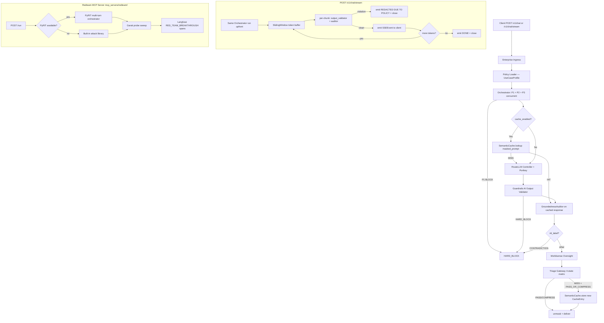
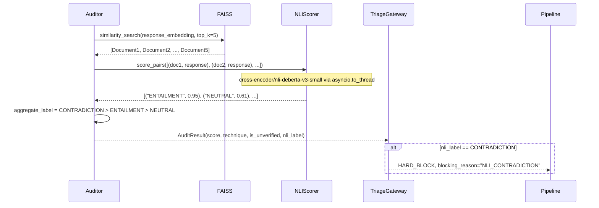
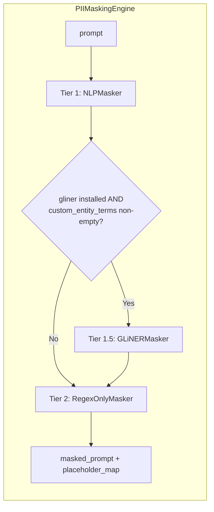
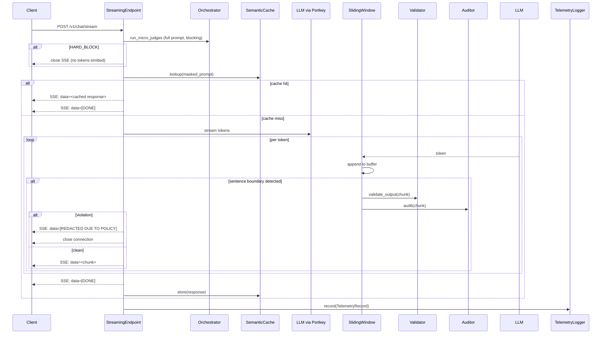

# Design Document: Gateway Phase 3 Upgrades

## Overview

This document specifies the technical design for five Phase 3 upgrades to the ControlPlane.ai Enterprise AI Proxy Gateway. Each upgrade integrates a new open-source component into the existing five-stage pipeline while respecting the established patterns: graceful degradation for optional dependencies, `asyncio.to_thread` for all CPU-bound operations, single-load-at-lifespan for heavy models, and zero changes to the non-streaming `/v1/chat` endpoint or the four-state triage matrix.

The five upgrades are:

| # | Feature | Component added | Pipeline location |
|---|---|---|---|
| 1 | Semantic Cache | GPTCache (optional) | Before RouteLLM Controller in Stage 2 |
| 2 | NLI Groundedness | sentence-transformers cross-encoder (optional) | Stage 3 Groundedness Auditor |
| 3 | GLiNER Custom Masking | GLiNER (optional) | Stage 1 PII Masking Engine, Tier 1.5 |
| 4 | SSE Streaming | FastAPI StreamingResponse + async generator | New endpoint; existing endpoint untouched |
| 5 | Redteam MCP Server | PyRIT + Garak (isolated process) | Replaces in-process fallback in redteam runner |

---

## Architecture

### Updated Pipeline Data Flow



### Lifespan Startup Additions

`app/main.py` `lifespan()` gains the following steps (inserted after existing steps):

```
Step 7  — SemanticCache initialisation (if gpicache installed)
Step 8  — GLiNER model load (if gliner installed); stored in app.state.gliner_model
Step 9  — NLIScorer model load (if sentence-transformers installed);
           stored in app.state.nli_scorer
Step 10 — RedteamMCPServer health probe (non-blocking; sets app.state.redteam_mcp_healthy)
```

None of the new steps block the existing steps. Each uses `asyncio.to_thread` for the model download/load.

---

## 1. Semantic Cache Integration

### Component: `app/router/semantic_cache.py` (new file)

The SemanticCache is a thin wrapper around GPTCache that stores `(masked_prompt_embedding, response_text, expiry_ts)` triples indexed by cosine similarity. It is instantiated once at startup and stored in `app.state.semantic_cache`.

```mermaid
sequenceDiagram
    participant Pipeline
    participant SemanticCache
    participant RouteLLM

    Pipeline->>SemanticCache: lookup(masked_prompt, profile)
    alt cache_enabled=False OR gpicache not installed
        SemanticCache-->>Pipeline: CacheLookupResult(hit=False)
    else
        SemanticCache->>SemanticCache: embed(masked_prompt) via asyncio.to_thread
        SemanticCache->>SemanticCache: query FAISS index for nearest embedding
        alt cosine_sim >= similarity_threshold
            SemanticCache-->>Pipeline: CacheLookupResult(hit=True, response=...)
            Note over Pipeline: skip RouteLLM; go directly to GroundednessAuditor
        else
            SemanticCache-->>Pipeline: CacheLookupResult(hit=False)
            Pipeline->>RouteLLM: route_and_call(...)
            RouteLLM-->>Pipeline: RoutingDecision
            Pipeline->>SemanticCache: store(embedding, response, ttl_seconds)
        end
    end
```

#### Interfaces

```python
# app/router/semantic_cache.py

from __future__ import annotations
from dataclasses import dataclass
from typing import Literal

@dataclass
class CacheLookupResult:
    hit: bool
    response: str | None          # populated on cache hit
    similarity: float | None      # cosine similarity of the winning entry; None on miss

class SemanticCache:
    """GPTCache-backed vector-similarity cache.

    Loaded once at startup and stored in app.state.semantic_cache.
    All embedding and index operations run via asyncio.to_thread.
    """

    def __init__(
        self,
        similarity_threshold: float = 0.92,
        embedding_model: str = "text-embedding-3-small",
    ) -> None: ...

    async def lookup(
        self,
        masked_prompt: str,
        cache_ttl_seconds: int,
    ) -> CacheLookupResult: ...

    async def store(
        self,
        masked_prompt: str,
        response: str,
        ttl_seconds: int,
    ) -> None: ...

    def invalidate_expired(self) -> int:
        """Prune TTL-expired entries; returns count removed."""
        ...
```

#### Graceful degradation

```python
# Top of semantic_cache.py
try:
    from gptcache import Cache              # type: ignore[import]
    from gptcache.embedding import Onnx    # type: ignore[import]
    _GPTICACHE_AVAILABLE = True
except ImportError:
    _GPTICACHE_AVAILABLE = False
    logger.info("gpicache not installed — SemanticCache disabled; all requests treated as cache misses")
```

When `_GPTICACHE_AVAILABLE` is `False`, `lookup()` always returns `CacheLookupResult(hit=False, response=None, similarity=None)` and `store()` is a no-op.

#### Data model changes — `app/models.py`

```python
class UseCaseProfile(BaseModel):
    # ... existing fields ...
    cache_enabled: bool = False
    cache_ttl_seconds: int = Field(ge=1, default=300)
    cache_similarity_threshold: float = Field(ge=0.0, le=1.0, default=0.92)

class TelemetryRecord(BaseModel):
    # ... existing fields ...
    cache_hit: bool = False          # default False — backward-compatible
```

#### Pipeline wiring — `app/main.py`

In `run_pipeline()`, immediately after the Orchestrator check and before `route_and_call()`:

```python
# Stage 2 preamble: semantic cache lookup
cache_hit = False
if ctx.profile.cache_enabled:
    cache_result = await app.state.semantic_cache.lookup(
        ctx.working_prompt,
        ctx.profile.cache_ttl_seconds,
    )
    if cache_result.hit:
        cache_hit = True
        ctx.llm_response = cache_result.response
        # Skip RouteLLM; jump directly to Groundedness Auditor
        # (GroundednessAuditor + Triage still run — Req 1.5)

if not cache_hit:
    decision = await route_and_call(...)
    ctx.routing_decision = decision
    ctx.llm_response = decision.response

# Post-triage: store cache entry on success
if not cache_hit and ctx.profile.cache_enabled and ctx.triage_result:
    if ctx.triage_result.triage_state in ("PASS_AND_DELIVER", "COMPRESS_AND_EDIT"):
        await app.state.semantic_cache.store(
            ctx.working_prompt,
            ctx.triage_result.response_content or "",
            ctx.profile.cache_ttl_seconds,
        )
```

#### Lifespan addition

```python
# Step 7 in lifespan()
from app.router.semantic_cache import SemanticCache, _GPTICACHE_AVAILABLE
if _GPTICACHE_AVAILABLE:
    semantic_cache = SemanticCache(
        similarity_threshold=settings.CACHE_SIMILARITY_THRESHOLD,
    )
    logger.info("SemanticCache initialised")
else:
    semantic_cache = SemanticCache()  # no-op stub
app.state.semantic_cache = semantic_cache
```

#### Correctness properties (Hypothesis)

**Property SC-1** — Cache hit bypasses RouteLLM: for any prompt that produces a cache hit, `RoutingDecision` must be `None` on `RequestContext`.

**Property SC-2** — TTL eviction: for any `CacheEntry` whose `expiry_ts < time.monotonic()`, `lookup()` must return `hit=False`.

**Property SC-3** — Exception isolation: if the GPTCache index raises any exception, `lookup()` must return `hit=False` and not propagate the exception.

**Property SC-4** — `cache_hit` telemetry: `TelemetryRecord.cache_hit` must be `True` if and only if the pipeline skipped the RouteLLM call.

---

## 2. NLI-Based Groundedness Auditor

### Component: `app/groundedness/auditor.py` (modified) + `app/groundedness/nli_scorer.py` (new)

The existing FAISS retrieval is kept as Stage 3a. A new NLI scoring stage (Stage 3b) runs the `cross-encoder/nli-deberta-v3-small` cross-encoder over each retrieved `(document, response)` pair to produce `ENTAILMENT`, `NEUTRAL`, or `CONTRADICTION` labels. The aggregate label follows the priority rule: any `CONTRADICTION` → `CONTRADICTION`; otherwise any `ENTAILMENT` → `ENTAILMENT`; otherwise → `NEUTRAL`.



#### `app/groundedness/nli_scorer.py` (new)

```python
# app/groundedness/nli_scorer.py
from __future__ import annotations
from typing import Literal

NLILabel = Literal["ENTAILMENT", "NEUTRAL", "CONTRADICTION"]

class NLIScorer:
    """Cross-encoder NLI scorer wrapping sentence-transformers.

    Loaded once in lifespan() and stored in app.state.nli_scorer.
    All inference via asyncio.to_thread.
    """

    def __init__(self, model_name: str = "cross-encoder/nli-deberta-v3-small") -> None: ...

    def score_pairs_sync(
        self,
        pairs: list[tuple[str, str]],  # list of (document_text, response_text)
    ) -> list[tuple[NLILabel, float]]: ...

    async def score_pairs(
        self,
        pairs: list[tuple[str, str]],
    ) -> list[tuple[NLILabel, float]]: ...

    @staticmethod
    def aggregate(labels: list[NLILabel]) -> NLILabel:
        """CONTRADICTION > ENTAILMENT > NEUTRAL priority rule."""
        if "CONTRADICTION" in labels:
            return "CONTRADICTION"
        if "ENTAILMENT" in labels:
            return "ENTAILMENT"
        return "NEUTRAL"
```

#### Optional import

```python
# Top of nli_scorer.py
try:
    from sentence_transformers import CrossEncoder  # type: ignore[import]
    _HAS_SENTENCE_TRANSFORMERS = True
except ImportError:
    _HAS_SENTENCE_TRANSFORMERS = False
    logger.info("sentence-transformers not installed — NLI scoring disabled; nli_label=None")
```

When `_HAS_SENTENCE_TRANSFORMERS` is `False`, `score_pairs()` returns an empty list and the auditor sets `nli_label=None`.

#### Updated `AuditResult` — `app/models.py`

```python
@dataclass
class AuditResult:
    groundedness_score: float           # [0.0, 1.0]
    technique: str                      # "embedding_similarity" or "nli_embedding_similarity"
    is_unverified: bool
    nli_label: Literal["ENTAILMENT", "NEUTRAL", "CONTRADICTION"] | None = None
```

#### Updated `TelemetryRecord` — `app/models.py`

```python
class TelemetryRecord(BaseModel):
    # ... existing fields ...
    nli_label: Literal["ENTAILMENT", "NEUTRAL", "CONTRADICTION"] | None = None
```

#### Updated `app/groundedness/auditor.py`

```python
async def audit(
    response: str,
    request_id: str,
    vector_store: VectorStore,
    nli_scorer: NLIScorer | None = None,
) -> AuditResult:
    try:
        embedding = await asyncio.to_thread(_embed, response)
        docs = await vector_store.similarity_search(embedding, top_k=5)
        score = _cosine_mean(embedding, [d.embedding for d in docs])

        nli_label = None
        technique = "embedding_similarity"

        if nli_scorer is not None and docs:
            pairs = [(doc.text, response) for doc in docs]
            try:
                scored_pairs = await nli_scorer.score_pairs(pairs)
                raw_labels = [label for label, _ in scored_pairs]
                nli_label = NLIScorer.aggregate(raw_labels)
                technique = "nli_embedding_similarity"
            except Exception as exc:
                logger.error("NLI_SCORER_ERROR request_id=%s: %s", request_id, exc)
                nli_label = None

        return AuditResult(
            groundedness_score=score,
            technique=technique,
            is_unverified=False,
            nli_label=nli_label,
        )
    except Exception as exc:
        logger.error("VECTOR_STORE_UNAVAILABLE request_id=%s: %s", request_id, exc)
        return AuditResult(
            groundedness_score=0.0,
            technique="embedding_similarity",
            is_unverified=True,
            nli_label=None,
        )
```

#### Updated Triage Gateway — `app/triage/gateway.py`

An additional Priority 0 check handles `NLI_CONTRADICTION`:

```python
def evaluate(
    groundedness_score: float,
    response_token_count: int,
    upstream_triage_state: TriageState | None,
    p3_clarity: Literal["CLEAR", "AMBIGUOUS"],
    profile: UseCaseProfile,
    response_content: str | None = None,
    nli_label: Literal["ENTAILMENT", "NEUTRAL", "CONTRADICTION"] | None = None,
) -> TriageResult:

    # Priority 0: NLI CONTRADICTION — independent of numeric score
    if nli_label == "CONTRADICTION":
        return TriageResult(
            triage_state="HARD_BLOCK",
            blocking_reason="NLI_CONTRADICTION",
            response_content=None,
        )
    # Priority 1–4: unchanged ...
```

#### Lifespan addition

```python
# Step 9 in lifespan()
from app.groundedness.nli_scorer import NLIScorer, _HAS_SENTENCE_TRANSFORMERS
if _HAS_SENTENCE_TRANSFORMERS:
    nli_scorer = await asyncio.to_thread(NLIScorer)
    logger.info("NLIScorer (cross-encoder/nli-deberta-v3-small) loaded")
else:
    nli_scorer = None
app.state.nli_scorer = nli_scorer
```

#### Correctness properties (Hypothesis)

**Property NLI-1** — Score range: `AuditResult.groundedness_score` is always in `[0.0, 1.0]`.

**Property NLI-2** — CONTRADICTION → HARD_BLOCK: for any `AuditResult` with `nli_label="CONTRADICTION"`, `evaluate()` must return `triage_state="HARD_BLOCK"` with `blocking_reason="NLI_CONTRADICTION"` regardless of numeric score.

**Property NLI-3** — Aggregation priority: for any label list containing `CONTRADICTION`, `NLIScorer.aggregate()` must return `"CONTRADICTION"`.

**Property NLI-4** — Scorer exception isolation: if the cross-encoder raises, `audit()` must return `nli_label=None` and a valid `AuditResult` without raising.

---

## 3. GLiNER Custom Entity Masking

### Component: `app/judges/gliner_masker.py` (new) + `app/judges/pii_masking.py` (modified)

GLiNER is inserted as "Tier 1.5" between `NLPMasker` and `RegexOnlyMasker`. It is driven by the `custom_entity_terms` list from the active `UseCaseProfile`. GLiNER is loaded once in `lifespan()` and passed in at scan-time.



#### `app/judges/gliner_masker.py` (new)

```python
# app/judges/gliner_masker.py
from __future__ import annotations
import asyncio, logging, re

logger = logging.getLogger(__name__)

try:
    import gliner  # type: ignore[import]
    _HAS_GLINER = True
except ImportError:
    _HAS_GLINER = False
    gliner = None  # type: ignore[assignment]

_CUSTOM_PLACEHOLDER_RE = re.compile(r"\[CUSTOM_ENTITY_REDACTED_\d+\]")

class GLiNERMasker:
    """Zero-shot named-entity scanner for custom corporate terms.

    The GLiNER model is injected at call-time from app.state.gliner_model
    so this class holds no model reference itself.

    Produces [CUSTOM_ENTITY_REDACTED_N] placeholders in document order.
    """

    name: str = "gliner"

    def scan_sync(
        self,
        prompt: str,
        entity_terms: list[str],
        gliner_model: object,
    ) -> tuple[str, dict[str, str]]:
        """Synchronous scan. Returns (masked_prompt, {placeholder: original})."""
        ...

    async def scan(
        self,
        prompt: str,
        entity_terms: list[str],
        gliner_model: object,
    ) -> tuple[str, dict[str, str]]:
        """Async wrapper — offloads to thread pool."""
        return await asyncio.to_thread(self.scan_sync, prompt, entity_terms, gliner_model)
```

`scan_sync` implementation detail: calls `gliner_model.predict_entities(text, labels=entity_terms)`, iterates returned spans in document order, assigns `[CUSTOM_ENTITY_REDACTED_N]` tokens, and builds the `{placeholder: original}` map.

#### Changes to `app/judges/pii_masking.py`

`PIIMaskingEngine.mask()` signature extended to accept `custom_entity_terms` and `gliner_model`:

```python
def mask(
    self,
    prompt: str,
    request_id: str,
    custom_entity_terms: list[str] | None = None,
    gliner_model: object | None = None,
) -> tuple[str, dict[str, str]]:
    # Tier 1: NLP
    sanitised, is_valid, _ = self._scanner.scan(prompt)
    placeholder_map = _build_placeholder_map(prompt, sanitised) if not is_valid else {}

    # Tier 1.5: GLiNER (conditional)
    if _HAS_GLINER and custom_entity_terms and gliner_model is not None:
        try:
            gliner_masked, gliner_map = self._gliner_masker.scan_sync(
                sanitised, custom_entity_terms, gliner_model,
            )
            sanitised = gliner_masked
            placeholder_map.update(gliner_map)
        except Exception as exc:
            logger.error("GLINER_SCAN_ERROR request_id=%s: %s", request_id, exc)

    with self._lock:
        self._maps[request_id] = placeholder_map
    return sanitised, placeholder_map
```

#### Data model changes — `app/models.py`

```python
class UseCaseProfile(BaseModel):
    # ... existing fields ...
    custom_entity_terms: list[str] = Field(default_factory=list)
```

#### Startup validation addition

`run_startup_validation()` adds a sixth synthetic prompt when GLiNER is installed:

```python
_GLINER_VALIDATION_PROMPT = "The Project Phoenix budget is $4.2M and is led by Alice Smith."
_GLINER_VALIDATION_TERMS = ["Project Phoenix"]
```

If the GLiNER round-trip fails, a `GLINER_DEGRADED` alert is emitted, the GLiNER tier is disabled for the session, and `is_healthy` remains `True`.

#### Lifespan addition

```python
# Step 8 in lifespan()
from app.judges.gliner_masker import _HAS_GLINER
if _HAS_GLINER:
    import gliner as _gliner_lib  # type: ignore[import]
    gliner_model = await asyncio.to_thread(
        _gliner_lib.GLiNER.from_pretrained, "urchade/gliner_medium-v2.1"
    )
    logger.info("GLiNER model loaded")
else:
    gliner_model = None
    logger.info("gliner not installed — custom entity masking disabled")
app.state.gliner_model = gliner_model
```

#### Correctness properties (Hypothesis)

**Property GL-1** — Placeholder format: every GLiNER-detected entity must produce a placeholder matching `\[CUSTOM_ENTITY_REDACTED_\d+\]`.

**Property GL-2** — Round-trip fidelity: `mask() → unmask()` on any prompt containing a custom entity term must be byte-for-byte identical after whitespace normalisation.

**Property GL-3** — Empty terms → tier skipped: `custom_entity_terms=[]` must produce output identical to Tiers 1 + 2 alone.

**Property GL-4** — Exception isolation: if `scan_sync()` raises, `mask()` must return the Tier-1/Tier-2 result without propagating the exception.

---

## 4. SSE Streaming Endpoint with Sliding-Window Triage

### Component: `app/ingress/streaming_router.py` (new) + `app/ingress/sliding_window.py` (new)

A new FastAPI router mounts at `/v1/chat/stream`. The existing `app/ingress/router.py` is **not touched**.



#### `app/ingress/streaming_router.py`

```python
from fastapi import APIRouter
from fastapi.responses import StreamingResponse

router = APIRouter()

@router.post("/v1/chat/stream")
async def handle_chat_stream(
    body: ChatRequest,
    request: Request,
    request_id: Annotated[str, Depends(request_id_dep)],
    policy_loader=Depends(get_policy_loader),
) -> StreamingResponse:
    """SSE streaming endpoint. Returns Content-Type: text/event-stream."""
    ...

async def _sse_generator(ctx: RequestContext, request: Request) -> AsyncIterator[str]:
    """Async generator yielding SSE-formatted strings.

    Yields:
      "data: <sentence chunk>\\n\\n"
      "data: [REDACTED DUE TO POLICY]\\n\\n"  on mid-stream violation
      "data: [STREAM_ERROR]\\n\\n"             on LLM exception
      "data: [DONE]\\n\\n"                     on clean completion
    """
    ...
```

#### `app/ingress/sliding_window.py`

```python
import re
from typing import AsyncIterator

_SENTENCE_BOUNDARY = re.compile(r"(?<=[.!?])\s+")

class SlidingWindow:
    """Accumulates LLM tokens and emits complete sentence-chunks.

    All buffer operations are synchronous (pure string ops, < 1 ms).
    Policy checks on assembled chunks are dispatched via asyncio.to_thread.
    """

    def __init__(self) -> None:
        self._buffer: str = ""

    def push(self, token: str) -> list[str]:
        """Push a token; return list of complete sentence-chunks (may be empty)."""
        self._buffer += token
        return self._flush()

    def flush_remaining(self) -> list[str]:
        """Flush buffered content as final chunk at end-of-stream."""
        if self._buffer.strip():
            chunks = [self._buffer]
            self._buffer = ""
            return chunks
        return []

    def _flush(self) -> list[str]:
        chunks: list[str] = []
        while True:
            m = _SENTENCE_BOUNDARY.search(self._buffer)
            if not m:
                break
            end = m.end()
            chunks.append(self._buffer[:end].strip())
            self._buffer = self._buffer[end:]
        return chunks
```

#### SSE terminal frames

| Condition | Final `data:` payload |
|---|---|
| Clean stream end | `[DONE]` |
| Policy violation mid-stream | `[REDACTED DUE TO POLICY]` |
| LLM exception | `[STREAM_ERROR]` |

#### Integration into `app/main.py`

```python
from app.ingress.streaming_router import router as streaming_router
app.include_router(streaming_router)
```

#### Correctness properties (Hypothesis)

**Property SSE-1** — Non-streaming endpoint unchanged: `POST /v1/chat` must return the same `ChatResponse` structure after this feature is added.

**Property SSE-2** — HARD_BLOCK before streaming: when P1 returns BLOCK, the SSE stream must close with no `data:` frames emitted.

**Property SSE-3** — Violation severs stream: when a chunk fails validation, the next and only subsequent frame must be `data: [REDACTED DUE TO POLICY]`, followed by close.

**Property SSE-4** — Clean stream terminates with DONE: when all chunks pass, the final frame must be `data: [DONE]`.

**Property SSE-5** — SlidingWindow sentence boundary: for any string with N sentence-ending punctuation marks, `push()` must emit exactly N chunks.

---

## 5. Redteam MCP Server

### Component: `mcp_servers/redteam/` (new directory)

Mirrors the `mcp_servers/worldsense/` isolation pattern: standalone FastAPI process, own `requirements.txt`, no `app.*` imports, Kiro `mcp.json` registration at port 9200.

```
mcp_servers/redteam/
├── server.py          — FastAPI: POST /run, GET /health, GET /report
├── requirements.txt   — pyrit, garak, fastapi, uvicorn, httpx
└── mcp.json           — Kiro MCP config (port 9200)
```

#### `mcp_servers/redteam/server.py`

```python
# NO imports from app.*
from fastapi import FastAPI
from pydantic import BaseModel

app = FastAPI(title="ControlPlane.ai Redteam MCP Server", version="1.0.0")

class RunRequest(BaseModel):
    session_id: str
    target_url: str = "http://localhost:8000"
    attack_categories: list[str] = []

class RunResponse(BaseModel):
    session_id: str
    status: str
    total_prompts_sent: int
    total_blocks: int
    total_breakthroughs: int
    block_rate: float
    attack_results: list[dict]
    garak_results: list[dict]

@app.post("/run", response_model=RunResponse)
async def run_redteam(body: RunRequest) -> RunResponse: ...

@app.get("/health")
def health() -> dict: ...

@app.get("/report")
def report() -> RunResponse | dict: ...
```

The server contains its own copy of the five built-in attack categories. It attempts to import `pyrit` and `garak` from its own venv; if absent, uses the built-in library.

#### `mcp_servers/redteam/requirements.txt`

```
fastapi>=0.111.0
uvicorn[standard]>=0.29.0
pydantic>=2.7.1
httpx>=0.27.0
pyrit>=0.4.0
garak>=0.9.0
```

#### `mcp_servers/redteam/mcp.json`

```json
{
  "mcpServers": {
    "redteam": {
      "command": "python",
      "args": ["mcp_servers/redteam/server.py"],
      "env": { "REDTEAM_MCP_PORT": "9200" },
      "disabled": false,
      "description": "Isolated Redteam MCP server running PyRIT and Garak in their own venv."
    }
  }
}
```

#### Updated `app/redteam/runner.py`

`RedTeamRunner` gains MCP-first delegation with in-process fallback:

```python
class RedTeamRunner:
    MCP_URL: str = "http://localhost:9200"
    _mcp_healthy: bool | None = None

    async def run(self, tracer=None) -> RedTeamReport:
        mcp_result = await self._try_mcp_run(tracer)
        if mcp_result is not None:
            return mcp_result
        return await self._run_in_process(tracer)   # existing logic

    async def _try_mcp_run(self, tracer) -> RedTeamReport | None:
        if self._mcp_healthy is False:
            return None
        try:
            async with httpx.AsyncClient(timeout=120.0) as client:
                resp = await client.post(
                    f"{self.MCP_URL}/run",
                    json={"session_id": str(uuid.uuid4()), "target_url": self._base_url},
                )
                resp.raise_for_status()
                self._mcp_healthy = True
                return self._parse_mcp_response(resp.json(), tracer)
        except Exception as exc:
            if self._mcp_healthy is not False:
                logger.warning("REDTEAM_MCP_UNAVAILABLE: %s", exc)
            self._mcp_healthy = False
            return None
```

#### Updated `.kiro/hooks/redteam_trigger.py`

```python
# Before calling POST /v1/redteam/run, health-check MCP server
MCP_HEALTH_URL = "http://localhost:9200/health"
try:
    health_resp = client.get(MCP_HEALTH_URL, timeout=2.0)
    mcp_ok = health_resp.is_success
except Exception:
    mcp_ok = False
if not mcp_ok:
    print("[redteam-hook] REDTEAM_MCP_UNAVAILABLE", file=sys.stderr)
# Always proceed to POST /v1/redteam/run regardless
```

#### Correctness properties (Hypothesis)

**Property RT-1** — MCP fallback: when MCP returns non-2xx, `run()` must complete without raising and return a valid `RedTeamReport`.

**Property RT-2** — No `app.*` imports: a static import scan of `mcp_servers/redteam/server.py` must find zero references to modules starting with `app.`.

**Property RT-3** — Breakthrough logging: for any `AttackResult` with `breakthrough=True`, the Langfuse tracer must be called with `name="RED_TEAM_BREAKTHROUGH"` and `level="ERROR"`.

---

## Data Model Summary

All changes are additive and backward-compatible.

```python
# UseCaseProfile additions (app/models.py)
cache_enabled: bool = False
cache_ttl_seconds: int = Field(ge=1, default=300)
cache_similarity_threshold: float = Field(ge=0.0, le=1.0, default=0.92)
custom_entity_terms: list[str] = Field(default_factory=list)

# AuditResult additions (dataclass)
nli_label: Literal["ENTAILMENT", "NEUTRAL", "CONTRADICTION"] | None = None

# TelemetryRecord additions (Pydantic — all default to backward-compatible values)
cache_hit: bool = False
nli_label: Literal["ENTAILMENT", "NEUTRAL", "CONTRADICTION"] | None = None
```

---

## Directory Structure

```
app/
├── ingress/
│   ├── router.py                ← unchanged
│   ├── streaming_router.py      ← NEW
│   └── sliding_window.py        ← NEW
├── judges/
│   ├── pii_masking.py           ← MODIFIED (GLiNER Tier 1.5)
│   └── gliner_masker.py         ← NEW
├── groundedness/
│   ├── auditor.py               ← MODIFIED (NLI stage)
│   └── nli_scorer.py            ← NEW
├── router/
│   ├── model_router.py          ← unchanged
│   └── semantic_cache.py        ← NEW
├── models.py                    ← MODIFIED (8 new fields across 3 models)
└── main.py                      ← MODIFIED (lifespan Steps 7-10, pipeline wiring)

mcp_servers/
├── worldsense/                  ← unchanged
└── redteam/                     ← NEW
    ├── server.py
    ├── requirements.txt
    └── mcp.json

.kiro/hooks/
└── redteam_trigger.py           ← MODIFIED (MCP health check at port 9200)
```

---

## Lifespan Startup Sequence (complete post-Phase 3)

```
1.  Policy Layer (PolicyLoader + watchdog)
2.  P1 scanner models (LLM Guard, via asyncio.to_thread)
3.  P3 spaCy model (via asyncio.to_thread)
4.  PIIMaskingEngine + startup validation
5.  TelemetryLogger + Langfuse tracer
5b. Guardrails AI validators
6.  RouteLLM Controller + FAISSVectorStore
7.  SemanticCache (gpicache optional — no-op stub if absent)
8.  GLiNER model (gliner optional — None if absent)
9.  NLIScorer (sentence-transformers optional — None if absent)
10. Redteam MCP server health probe (non-blocking; result cached in app.state)
```

---

## Performance Budget Compliance

| Component | CPU path | asyncio.to_thread | Ceiling |
|---|---|---|---|
| SemanticCache.lookup | GPTCache embed + FAISS query | Yes | ≤ 2 ms (hit); ≤ 20 ms (miss embed) |
| NLIScorer.score_pairs | cross-encoder inference | Yes | ≤ 150 ms for top-5 pairs |
| GLiNERMasker.scan_sync | GLiNER NER inference | Yes | ≤ 100 ms per request |
| SlidingWindow.push | pure string ops | N/A | < 1 ms |
| Redteam MCP (in-process fallback) | PyRIT/Garak probes | Yes | out-of-band |

---

## Error Handling Matrix

| Component | Error condition | Behaviour |
|---|---|---|
| SemanticCache | Any exception | Log `SEMANTIC_CACHE_ERROR`; treat as cache miss; pipeline continues |
| NLIScorer | Exception during scoring | Log `NLI_SCORER_ERROR`; set `nli_label=None`; return cosine-only score |
| GLiNERMasker | Exception during scan | Log `GLINER_SCAN_ERROR`; skip GLiNER result; Tier 2 runs normally |
| GLiNERMasker | Startup validation failure | Log `GLINER_DEGRADED`; disable GLiNER tier; `is_healthy=True` |
| SlidingWindow | LLM exception mid-stream | Emit `data: [STREAM_ERROR]`; close SSE; record TelemetryRecord |
| Redteam MCP | Unreachable / non-2xx | Log `REDTEAM_MCP_UNAVAILABLE` once; fall back to in-process |
